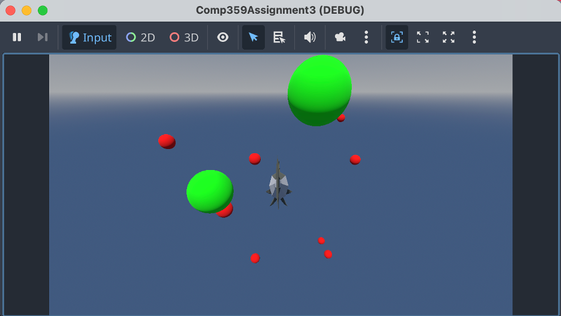
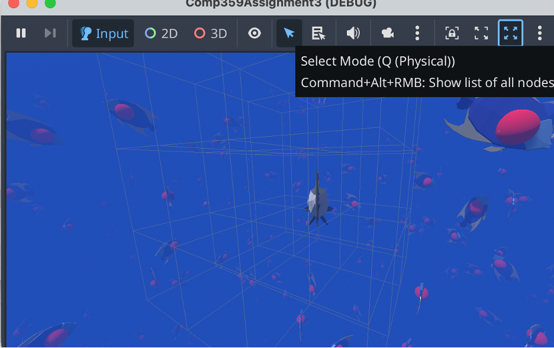
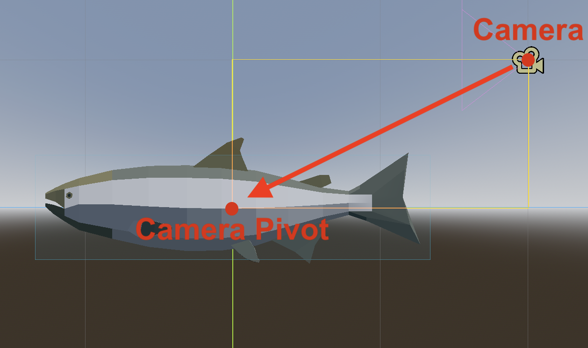

# Spatial Sea --- Assignment 3

**Markus Webster (300200398)**\
**Loreena Alfonso (300206896)**\
**Robert Bocsanu (300198372)**

## 📘 Table of Contents

1.  [Problem Statement](#problem-statement)\
2.  [Plan of Work](#plan-of-work)\
3.  [Analysis Framework](#analysis-framework)\
4.  [Debugging and Testing](#debugging-and-testing)
    -   [Markus](#markus)\
    -   [Loreena](#loreena)\
5.  [Log of Work](#media)
6.  [Licences](#licences)\

## Problem Statement 🐠🐠🐠

Hash tables implemented for 3D spatial management of moving items. To achieve this we have built a playable game in Godot: Spatial Sea. We leveraged the spatial hashmap to detect fish the you (the player) can eat, enable the schooling behaviour of the fish and the hunting action of the predators trying to eat you! 

## Plan of Work

We planned this work to be a collaborative effort between the three of us. In our first meeting we agreed that we would create this game, expanding the work so that each person had substantial contributions towards a portfolio project. We agreed to meet weekly and provide updates in our group channel on Discord. Robert and Markus had experience with Godot so we had a mini tutorial about the development environment to all get on the same page with the features.

In terms of the division of tasks, Markus would implement the spatial hash base class while Robert initialized the game, creating a player and the ocean environment. Loreena worked on adapting the boids flocking algorithm to the godot language and making the fish flee from the player. Robert finalized the sprinting action and the leveling-up logic. Once the basics were done, we all worked together to bring the polish. 

## Analysis Framework

### **Function Time Complexities**
The spatial hash algorithm is implemented as a class and uses a Dictionary as a hashtable called cells, and has functions:

#### `getKey()`

-   This function has time complexity O(1) since it only consists of constant time operations.

#### `add()`

- This function should have average time complexity O(1) since the dictionary lookup is O(1), unless a significant number of objects belong to the same key, then worst case the lookup can degrade to O(n).

#### `remove()`

-  On average this function will be O(m) where m is the number of objects in the cell since removing an object from the dictionary requires linearly searching the array of objects. Worst case, if every object is in the same cell, then we get O(n).

#### `update()`

-   This function uses constant time operations, as well as add() and remove(). Combining these time complexities gives average case O(m) and worst case of O(n) from remove.

#### `query()`

-  This function checks c cells, with $m_c$ objects in cell c. The time complexity is then O($c*m_c$) with a worst case of O(n) if all of the objects are in c cells.

### **Overall Complexity**

Overall, the spatial hash algorithm runs between O(1) and O(n). And given the way it was used in this project, it should always run closer to constant time, since the objects are spread out.

## 🧪 Debugging and Testing

### **Markus**

Initially, in order to test the spatial hash algorithm before adding the game elements, colored spheres were used to test.\
It was similar to the video suggested for this topic, where in this case when the player gets within a close enough distance to the other spheres, they turn from red to green.

This strategy worked great for making sure the spatial hash works as intended.

A debug feature was added to attempt to visualize the cells \
around the player that were being used for detection.
While faint, you can see the cells around the player fish. Only these cells are searched for nearby fish.

### **Loreena**

Most of the debugging involved changes in conventions from Godot 3 to 4. In addition to that, when working on the flocking algorithm, smoothing function was added but the fish started spinning like crazy in place. When that was fixed, that the fleeing action was so stunted, they were removed from the whole thing. The coloured balls  remained in place for a long time, turning different colours to see when the neighbours found their close fish. Then during some play testing of the game, we realized that it was very hard to detect by eye which fish were bigger than you and would eat you vs you could eat. Markus added the red and green glow to help make it visually obvious.

### **Robert**

The fish movement was straightforward to implement and used multiple techniques from GDQuest (2024). The forward and left/right movement was implemented using the fish’s current look vector and right vector respectively. The camera is attached to a pivot node in the center of the fish which can be rotated in the same direction as the fish to move the camera accordingly — so that separate logic isn’t required for the camera.

Sprinting uses the Input is_action_pressed() method to see when the shift button is being pressed. It then increases the camera’s FOV and the player’s speed and emits a signal that the player is sprinting for the GUI to listen to and update accordingly.

For adding the game over screen, the most significant problem was properly removing and resetting all of the objects in the scene. This involved calling free() on all fish, the player, and the spatial hash and reinstating them when the “respawn” button was pressed.

Lastly, in order to accurately search a specific distance from the player, the query() method was modified to take an optional distance_to_check parameter. The function then performs calculations to see how many boxes around the player need to be checked to ensure all fish at that distance are found. While with a small hash size, like the one we used, this was fairly accurate, fish not in the radius of distance_to_check may be included depending on where the character is in their box. Additionally, the distance_to_check describes the radius of a cube to be checked — not a sphere — meaning we had to include extra checks after the query() to ensure the neighbors were not too far away.

## Log of Work

commit cb1f6bd068bb8906258beb3f21eac77773b69ec7
Author: lalfonso00 <loreenaalfonso@gmail.com>
Date:   Tue Dec 2 15:43:23 2025 -0800

    code cleanup

commit 748ab09b849896aa179185a184787ddeb5504b2b
Author: lalfonso00 <loreenaalfonso@gmail.com>
Date:   Mon Dec 1 21:36:45 2025 -0800

    add animations

commit 62d39b23fd0f95c7931545c13aa315f2124e24ff
Author: Robert Bocsanu <rbocsanu@gmail.com>
Date:   Mon Dec 1 20:26:26 2025 -0800

    SpatialHash query distance calculations

commit 1f4a8a3a8b4ad8f5bc657bb380a6d494afd89090
Author: lalfonso00 <loreenaalfonso@gmail.com>
Date:   Mon Dec 1 19:04:32 2025 -0800

    add sound effects

commit 32ba2577d49b5372a68749261ccb7bfb768f5b6a
Author: lalfonso00 <loreenaalfonso@gmail.com>
Date:   Mon Dec 1 18:32:30 2025 -0800

    sound effects

commit 2cc09e57d78e8faf5330314bff2f760ee44e779b
Author: lalfonso00 <loreenaalfonso@gmail.com>
Date:   Mon Dec 1 16:02:12 2025 -0800

    more space less predators

commit 63e39f1658ae6e9884f86246848481b1393071f2
Author: Markus Webster <markuswebster2004@gmail.com>
Date:   Sun Nov 30 00:27:10 2025 -0800

    Added glow and better ocean

commit d715bfa3998e745ad42095a7a19315b49afbc3ae
Author: Robert Bocsanu <rbocsanu@gmail.com>
Date:   Sat Nov 29 22:35:59 2025 -0800

    Larger fish eat player and game over screen

commit dd4dd44203a6bf993e3dfd8911a138ebe885b341
Author: Robert Bocsanu <rbocsanu@gmail.com>
Date:   Fri Nov 28 19:34:13 2025 -0800

    Energy bar and sprinting

commit deb1db8eb6480077867b089a0d0e41b1ae20623f
Author: Markus Webster <markuswebster2004@gmail.com>
Date:   Thu Nov 27 22:02:03 2025 -0800

    Added new fish

commit d2dbdd369ee4811ee486f5b243f19d130685486e
Author: lalfonso00 <loreenaalfonso@gmail.com>
Date:   Sat Nov 22 16:34:36 2025 -0800

    scorebar initialization

commit 645087e10a9addc218e2e2212d8a6d114a3fc820
Author: lalfonso00 <loreenaalfonso@gmail.com>
Date:   Fri Nov 21 23:01:14 2025 -0800

    fish initializations

commit 318477490d34ae855dd49db7fde55c1117cd8d12
Author: Markus Webster <markuswebster2004@gmail.com>
Date:   Fri Nov 21 19:15:27 2025 -0800

    Added debugging and ocean features

commit 5b3ebc047e41628f2eed0de7b34f68d1b4e9972f
Author: Markus Webster <markuswebster2004@gmail.com>
Date:   Fri Nov 21 02:02:14 2025 -0800

    Added SpatialHashing

commit fc30fd9ef4f7d555185c920327d8c6f00ccd9b36
Author: Robert Bocsanu <rbocsanu@gmail.com>
Date:   Tue Nov 18 21:47:08 2025 -0800

    Basic fish movement

commit 985e49ff615e2ad5a9502655b863f854bb0a512b
Author: Robert Bocsanu <rbocsanu@gmail.com>
Date:   Fri Nov 7 19:20:16 2025 -0800

    initial commit

## References
Godot Engine contributors. (2025). Godot Engine (Version 4.5) [software]. https://godotengine.org/

Boids. (n.d.). Cs.stanford.edu. https://cs.stanford.edu/people/eroberts/courses/soco/projects/2008-09/modeling-natural-systems/boids.html

Godot Community. (n.d.). Godot Docs – 4.5 branch. https://docs.godotengine.org/en/stable/ 

Poly by Google. (2017). Fish. poly.pizza. https://poly.pizza/m/aEyLrUMMoUK

Quaternius. (2021). Fish. poly.pizza. https://poly.pizza/m/XWl86YFtpF

Quaternius. (2022). Swordfish. poly.pizza. https://poly.pizza/m/7hMOlBjln0

Quaternius. (2023). Shark. poly.pizza. https://poly.pizza/m/YYsK3gRCBZ

‌sergioabreu-g. (2025). GitHub - sergioabreu-g/boids: The Boids Algorithm implemented in Godot. GitHub. https://github.com/sergioabreu-g/boids

‌Generative AI was used to help navigate and understand the Godot documentation.

## Licences

Creator Subscription Music License
29 Last update: 29 April 2025
 
Intro
This License. The terms set forth in this Creator Subscription Music License Agreement (this “License”) apply between you and Epidemic Sound AB, reg. no. 556781-0899, Västgötagatan 2, 118 27 Stockholm, Sweden (hereinafter “Epidemic Sound”, “we”, “our”, “us”) and regulate your use of the License and the Sound Recordings contained in the Epidemic Sound music catalog available through the Site from time to time (collectively the “Licensed Works”). Please note that, except as may be explicitly provided herein, the Terms of Use are an integral part of this License and the terms found therein apply in full to your use of the License. Capitalized terms used but not defined herein shall have the meanings set forth in the Terms of Use. We ask you to read this License and the Terms of Usecarefully since they affect your legal rights and govern your use of Epidemic Sound’s online music catalog service.
Acceptance. By clicking "I agree", signing up for the “Creator Subscription”, or otherwise signifying your acceptance of this License you are agreeing to be legally bound by this License and the Terms of Use, available on the Site and incorporated herein by reference. You further acknowledge that you have read our Privacy Notice and Cookie Policy, also available on the Site.
 
Who is this for?
Personal use. This License and the rights granted herein are intended solely for your own personal use and grants you the right to use the Licensed Works in video and podcast productions created by you for the purpose of use and distribution online in accordance with the terms below. If you want to use the Licensed Works for any other purpose not expressly permitted under this License, e.g. if you are creating content for a corporate channel (meaning a channel owned and/or operated by a business) or creating content on behalf of a third party, you can find other appropriate licenses available on the website, or you can reach out to us here.
One single user. This License only covers use by one individual. If you need to add users, you can sign up for additional Licenses. If we have reasons to believe that more than one person is using the same account, we reserve the right to either (i) immediately terminate the account, without refunding any prepaid Fees, and/or (ii) with retroactive effect assess additional Fees on you, calculated in each instance on the per-user pricing for each additional user.
 
Your License
Soundtracking your productions
Synchronization license. Subject to the terms and conditions of this License, Epidemic Sound hereby grants to you during the Subscription Period (as defined below) the right to access the Site and to make copies of the Licensed Works in order to synchronize them, in whole or in part, in video and podcast productions produced by yourself (your “Productions”).
No standalone use. The purpose of this License is to make available for you the use of our music and sound effects in the background of your Productions to boost your own content. You may not make available, use or in any other way exploit the Licensed Works for the purpose of making the Licensed Works (in whole or in part) available on a standalone basis, hence without being synchronized with a Production in accordance with the purposes of this License, as determined by Epidemic Sound in its reasonable discretion, including where a Production is essentially tantamount to use of the Licensed Works on a standalone basis or where the Licensed Works constitute a primary value of the content that you create. By way of example, you may not use or in other way exploit the Licensed Works:
for the purpose of creating a music listening experience, including, but not limited to, uses where complete or almost complete Licensed Works, on its own or as part of a compilation, are combined with accompanying visual/narrative elements that are of subordinate importance (such as, but not limited to, still image(s), panning motions, loops or other limited animation/video/audio);
in any way to repackage the Licensed Works or upload or use them, in whole or in part, in any third-party AI tool, as audio samples, music or sound libraries, sound effects, music beds or to upload them in any music recognition systems for any purpose, and/or in any way use, distribute or otherwise exploit the Licensed Works as your property; or
in any way that is intended to allow third parties to download, reproduce, stream, and/or otherwise access or use the Licensed Works, in whole or in part, on a standalone basis, including without limitation in any digital templates or other applications enabling end users to synchronize or otherwise combine the Licensed Works with other content, or in any manner enabling users to create or order on-demand products (such as electronic greeting cards or ringtones) or make the Licensed Works available in any physical products (e.g. in speakers).
You can read more in our FAQ here.
No illegal, immoral or political content. You may not use any Licensed Works in connection with any material or otherwise in a manner or context that is defamatory, illegal or inciteful of an illegal act; immoral; racist; hateful or discriminating against any person based on for example race, nationality, religion, ethnic identity, gender, gender identity or sexual orientation; constitutes encouragement of violence or use of weapons; pornographic; or in a manner or context that otherwise violates any rights of anyone associated with the Licensed Works. You shall comply with any applicable laws and regulations. Moreover, you may not use the Licensed Works in connection with sensitive subjects without the prior written consent of Epidemic Sound. Sensitive subjects include, but are not limited to, political content, such as the promotion, advertisement or endorsement of any party, candidate or elected official; and “adult videos” and promotion of adult entertainment venues, escort services, or the like.
No edits. You may cut, loop and fade in/out the Licensed Works, and you may use individual stems if and as made available to you, but you may not otherwise edit, alter, or change the Licensed Works, including but not limited to altering the fundamental character of the Licensed Works and creating any derivative works thereof (meaning that you may not create new music based on any Licensed Works).
No paid media ads or third party exploitation. You may not use the Licensed Works in advertisements or other commercial production (meaning productions published within paid media space, such as, but not limited to, online pre/mid/post-rolls). You further have no right to use the Licensed Works in any production that is produced for the purpose of being used, licensed, sold or in any other way exploited by any third party, including that you may not synchronize the Licensed Works with any production that promotes and/or integrates products and/or services of a corporate brand/entity, when such productions are intended to be uploaded or embedded on third party channels or websites.
No broadcast type content. You are not allowed to use the Licensed Works in any broadcast type of content such as feature films and TV shows, including documentaries, news, sports broadcasts or cartoons or other children shows, irrespective of whether such broadcast type of content is intended for linear television or any form of distribution via video-on-demand. If you’re looking to produce this type of content, check out our Enterprise plan here.
No theme songs or trade marks. You may not use the Licensed Works as part of a theme song, logo, trademark or service mark.
No NFTs. You may not use the Licensed Works in non-fungible tokens (“NFTs”), blockchain or substantially equivalent technologies.
 
Distributing your Productions
Distribution license. Subject to the terms and conditions of this License, Epidemic Sound grants to you the right to make available worldwide and in perpetuity, any Productions containing any Licensed Works on your Online Personal Channels (as defined below), provided that you have completed, uploaded, and published such Production(s) on at least one of your Online Personal Channels during the Subscription Period (as defined below).
Where can I upload my Productions? This License grants you the right to publish your Productions on your own personal channels, pages, or other personal spaces across websites, social media platforms and video sharing platforms, in apps, and anywhere else online (“Online Personal Channels”). Conversely, you cannot make available your Productions “offline”, e.g. on linear television, including but not limited to broadcast, IPTV, cablecast, or satellite television, as theatrical releases, or make it available in a live setting (e.g. during a trade fair or event). As mentioned above, the rights granted do not include any right to license or sublicense to any third party the right to exploit any Production for any purpose.
For how long is the license valid? You can use the Licensed Works to create new Productions during the Subscription Period (as defined below), and whatever Production you have completed, uploaded, and published on your Online Personal Channels during the Subscription Period (as defined below) will remain licensed for you to use forever.
Credits. You shall ensure that credit is appropriately accorded in connection with your use of Licensed Works, – to the extent reasonably possible and otherwise in relation to uses where it is standard practice to do so or if credits are provided for other music or content providers. Such credit shall – be accorded in a form substantially similar in form and substance to the following: “Artist’s Name / Title of Licensed Work / courtesy of Epidemic Sound”. The above credit will, if possible, be displayed as a hyperlink to www.epidemicsound.com.
Platform limitations. Please note that various platforms may have their own restrictions that apply from time to time, such as limitations on the permitted length of videos with music. As a result, even though you have been granted a license from Epidemic Sound to use the Licensed Works in accordance with the terms and conditions in this License, such platforms might limit how you exercise such rights on such platforms, and Epidemic Sound shall have no liability for such platform restrictions.
 
Monetization
Monetization. Subject to your compliance with this License, and proper clearing in accordance with the terms herein, you may allow, and receive remuneration from, the display of third-party ads in connection with making available your Productions on social media or other platforms such as YouTube offering such monetization opportunities (you may clear your Productions for monetization).
Clearing. You are responsible for clearing the Productions and/or relevant Personal Online Channels with Epidemic Sound, in accordance with the instructions that Epidemic Sound provides from time to time. You may clear one channel/page/profile/feed/etc. per platform. Without correct Clearing, Epidemic Sound is unable to tell a licensed Production from unlicensed use.
Unlicensed and non-cleared use. Epidemic Sound reserves the right to fully monetize unlicensed use of the Licensed Works on YouTube and/or other platforms. Epidemic Sound reserves the right to demonetize any Productions containing Licensed Works that are not correctly cleared. Should a Production licensed under this License be demonetized by Epidemic Sound, you may notify Epidemic Sound through this webform and Epidemic Sound will discontinue such demonetization without undue delay. Epidemic Sound will have no responsibility, and will not reimburse you, for any demonetization of Productions by Epidemic Sound for any period prior to such Productions having been correctly cleared for monetization. Please note that in relation to certain platforms, Epidemic Sound may use systems to correctly identify use of, or claim ownership of, the Licensed Works in content, including your Productions, uploaded to such platforms, e.g. to ensure correct attribution, but such identification does not affect your right to monetize your Productions on such platforms.
 
Fees
In consideration for the Service and the rights granted herein, you agree to pay any applicable Fees in accordance with the Terms of Use. Except as set forth in this License, no additional fees other than the Fees will be owed by you in relation to your permitted use of the Licensed Works hereunder, to (i) Epidemic Sound, (ii) any composer, performer, producer or other person involved in the creation of the Licensed Works or (iii) any collecting society except if the collection is exclusively delegated to such society by local statute, irrespective of the membership of, or any contractual mandate from, any of the composers, performers or other rights holders in the music.
 
What happens if the License expires or is terminated?
This License shall enter into force upon your acceptance of the Terms of Use and the terms set forth herein and shall remain in force until terminated by you or us in accordance with the Terms of Use ( the “Subscription Period”).
As mentioned above, you do not need to take down or otherwise withdraw any Productions published in accordance with this License, even after expiration or termination of the Subscription Period. For clarity, however, after expiration or termination of the Subscription Period you may not use the Licensed Work(s) to create any new Productions, including without limitation that you may not use the Licensed Work(s) to create any new versions of Productions, even if you have downloaded such Licensed Work(s) during the Subscription Period.
 
Outro
Amendments. Occasionally Epidemic Sound may, in its discretion, make amendments to the terms and conditions of this License in accordance with the provisions of the Terms of Use.
No other rights. You may only use the Licensed Works under and subject to the rights granted under the terms and conditions of this License and the Terms of Use. All rights not expressly granted hereunder are reserved by Epidemic Sound, including without limitation, that the rights granted hereunder do not include the right to collect public performance royalties with respect to the Licensed Works, the right to license or sub-license to any third party the right to exploit any Licensed Work or Production, or to exploit any Licensed Work or Production in any other method, manner or media than those specifically provided hereunder. All rights and licenses granted hereunder are non-exclusive, non-transferable and non-assignable and may not be sub-licensed other than as expressly permitted under this License.
Now, let’s find the perfect soundtrack for your story!
 
 Poly Pizza Terms Of Service
Poly Pizza, ("Poly Pizza," "we" or "us") is pleased to provide you with access to the Poly Pizza platform, which allows a user ("User" or "you") to upload, download, and/or publish 3D files on the Poly Pizza website. All elements of the Poly Pizza platform are referred to herein as the "Services," and may be modified from time to time at our sole discretion.
By registering with us, or by using the Services, you agree to be bound by these Terms of Use (the "Agreement,") which we may update from time to time. Your continued use of the Services constitutes your consent to such changes. Please read this agreement carefully. If you do not agree to these terms of use, you may not use the services.
Our privacy policy is considered part of this Agreement. By using the Services, you agree that your information may be collected and used in accordance with the Poly Pizza Privacy Policy (PPPP).
User Account
You may not transfer your account to any third party. You are responsible for keeping your account login information confidential and for any and all activities that occur under your account. You agree to notify us immediately if you suspect or become aware of any unauthorized use of your account. Poly Pizza retains the right at any time to deactivate, reallocate or rename your username at its sole discretion.
We may, in our sole discretion, refuse to offer the Services to any person or entity. We may terminate your right to use the Services, or any portion thereof, and block or prevent your future access to and use of the Services.
THE SERVICES ARE NOT INTENDED FOR CHILDREN UNDER 13, and persons under the age of 13 are prohibited from registering with or using the Services. You represent and warrant that you are more than 18 years of age or, if you are above 13 and below 18 years of age, you are an emancipated minor, or possess legal parental or guardian consent, and are fully able and competent to abide by and comply with the terms, conditions, obligations, affirmations, representations, and warranties set forth in this Agreement. This provision is void where prohibited by law and the right to access the Services is revoked in such jurisdictions
Content Ownership
User Content includes all the 3D models, images and comments, uploaded by Users that make up the Services. We do not claim ownership over any User Content.
You are solely responsible for ensuring that any User Content you submit to the Services complies with any applicable laws and third party rights, including but not limited to any intellectual property rights, privacy rights and publicity rights. You agree that any information included in your User Content may be used in accordance with our Privacy Policy. Poly Pizza always has the right, in its sole discretion, to accept or reject any given User Content. You agree that you will not upload content with malicious intent such as posting links to fraudulent websites or including additional content in user uploaded 3D model files with intent to cause harm. In doing so we reserve the right to immediately terminate your access to the services.
By downloading User Content made available by other Users, you agree to adhere to the terms of the Creative Commons license that applies at the time of download.
Uploading
By submitting User Content, you represent and warrant that (i) you own or otherwise control all of the rights to your User Content, (ii) the use of your User Content does not violate this Agreement or the law, and will not violate any rights of or cause injury to any person or entity.
Limitations
You agree that you bear all risks associated with your User Content. Poly Pizza has no duty to store copies of User Content for future availability to you or any user. Poly Pizza does not permit the infringement of intellectual property rights on the Services, and will remove User Content from the Services if properly notified that such User Content infringes on another's intellectual property rights. We reserve the right to remove User Content from the Services, in whole or in part, without prior notice, for any reason or for no reason at all. We reserve the right to terminate the account of any User of the Services who has been notified of infringing activity more than once and/or has had User Content removed from the Service in the past. We also reserve the right to decide whether User Content is appropriate and complies with this Agreement for violations other than violations of intellectual property law. This shall extend to the right of Poly Pizza to edit, modify, moderate, re-format, change or otherwise remove all or part of the descriptions, comments and/or annotations that You and/or third parties add and/or make in relation to your User Content, in any manner that We may determine, whenever We deem it appropriate
You agree that you will not use the Services to:
Promote any illegal activity, or advocate, promote or assist any unlawful act;
Violate the legal rights (including the rights of publicity and privacy) of others or contain any material that could give rise to any civil or criminal liability under applicable laws or regulations or that otherwise may be in conflict with this Agreement and our Privacy Policy;
Transmit any material or content that is pornographic, dehumanizing, threatening, harassing, libelous, hate-oriented, harmful, defamatory, racist, xenophobic, or illegal;
Transmit any material or content that is inappropriate for families or otherwise suitable only for audiences over the age of 13;
Transmit any material or content that attempts to falsely state or otherwise misrepresent your identity or affiliation with a person or entity;
Transmit material or content that promotes, provides, or relates to instructional information about illegal activities or promotes physical harm or injury against any individual or group;
Transmit or otherwise make available any unsolicited or unauthorized advertising, promotional materials, "junk mail," "spam," "chain letters," "pyramid schemes," or any other form of solicitation;
Transmit or encourage the transmission of any material that may infringe the intellectual property rights or other rights of third parties, including trademark, copyright, patent, or right of publicity, or which otherwise constitutes or promotes counterfeit materials or goods;
Use the services in a manner that (a) is likely to interrupt, suspend, slow down or hinder the continuity of the Services, (b) constitutes an intrusion or attempt to break into the Services or Poly Pizza's computer or networking systems, (c) will divert of the Services' system resources, (d) may place a disproportionate load on the infrastructure of the Services, and (e) constitutes an attack on security and authentication measures of the Services or Poly Pizza's computer or networking systems;
Intrude into a third party's computer system, engage in any activity that may damage, control, interfere with or intercept all or part of a third party's computer system and violate its integrity or security, or otherwise transmit any materials or content that is harmful for third party information systems (including but not limited to viruses, worms, Trojans);
Otherwise use the Services for purposes other than those for which they were designed;
Limitations on Automated Use
You shouldn't use bots or access our Services in malicious or un-permitted ways. While accessing or using the Services, you may not:
use bots, hacks, or cheats while using our site;
create manual requests to Poly Pizza's servers;
tamper with or use non-public areas of the Services, or the computer or delivery systems of Poly Pizza and/or its service providers;
probe, scan, or test any system or network (particularly for vulnerabilities), or otherwise attempt to breach or circumvent any security or authentication measures, or search or attempt to access or search the Services by any means (automated or otherwise) other than through our currently available, published interfaces that are provided by Poly Pizza (and only pursuant to those terms and conditions), unless you have been specifically allowed to do so in a separate agreement with Poly Pizza, or unless specifically permitted by Poly Pizza, Inc.'s robots.txt file or other robot exclusion mechanisms;
scrape the Services, scrape Content from the Services, or use automated means, including spiders, robots, crawlers, data mining tools, or the like to download data from the Services or otherwise access the Services;
employ misleading email or IP addresses or forged headers or otherwise manipulated identifiers in order to disguise the origin of any content transmitted to or through the Services;
use the Services to send altered, deceptive, or false source-identifying information, including, without limitation, by forging TCP-IP packet headers or e-mail headers; or
interfere with, or disrupt or attempt to interfere with or disrupt, the access of any User, host, or network, including, without limitation, by sending a virus to, spamming, or overloading the Services, or by scripted use of the Services in such a manner as to interfere with or create an undue burden on the Services.
Users are expressly forbidden from using any part of the service, including data, images, and text, for the purpose of scraping, data mining, or any form of extraction for machine learning or artificial intelligence training without explicit written permission from us.
Changes
Poly Pizza may revise these Terms of Service for its Website at any time without prior notice. By using this Website, you are agreeing to be bound by the current version of these Terms of Service.
CD Clause
You agree that at any time a User of the Services may gain access to a reward of our choosing by recording themselves performing the ‘Chicken dance’ to ‘Der Ententanz’ (AKA "The Chicken Dance") as composed by Werner Thomas and submitting it via email. To be binding the dance must be performed as outlined in the instructions below:
Pinch your fingers and thumbs together in front of your chest 4 times.
Flap your arms four times.
Wiggle side to side four times while getting your back side as close to the ground as you can.
Clap four times.
Repeat steps 1-4 until you hear the swing-like music.
Swing around with a partner or group until the swing-like music ends. Start back at the beginning.
Disclaimer of warranties
THE SOFTWARE IS PROVIDED "AS IS", WITHOUT WARRANTY OF ANY KIND, EXPRESS OR IMPLIED, INCLUDING BUT NOT LIMITED TO THE WARRANTIES OF MERCHANTABILITY, FITNESS FOR A PARTICULAR PURPOSE AND NONINFRINGEMENT. IN NO EVENT SHALL THE AUTHORS OR COPYRIGHT HOLDERS BE LIABLE FOR ANY CLAIM, DAMAGES OR OTHER LIABILITY, WHETHER IN AN ACTION OF CONTRACT, TORT OR OTHERWISE, ARISING FROM, OUT OF OR IN CONNECTION WITH THE SOFTWARE OR THE USE OR OTHER DEALINGS IN THE SOFTWARE. No advice or information obtained by you from Poly Pizza, or otherwise through the Services, will create any warranty not expressly stated herein.
Indemnity
You agree to indemnify and hold Poly Pizza and its affiliates, subsidiaries, owners, directors, employees and agents harmless from and against any and all claims, demands, suits, proceedings, liabilities, judgments, losses, damages, expenses and costs assessed or incurred by Poly Pizza directly or indirectly, with respect to or arising out of: (i) your failure to comply with this Agreement; (ii) your breach of your obligations under this Agreement; (iii) your use of the rights granted hereunder, including without limitation any claims made by any third parties; (iv) your violation of any third party right, including without limitation any intellectual property, right of publicity, or privacy right; and/or (v) any claim that any of your User Content caused damage to a third party
DMCA
Poly Pizza respects the intellectual property rights of others, and complies with the provisions of the Digital Millennium Copyright Act (DMCA) applicable to Internet service providers (17 U.S.C. § 512, as amended) as well as the The Australian Copyright Act of 1968. We respond to clear notices of alleged copyright infringement, and infringing materials posted by Users can be identified and removed pursuant to this complaint procedure.
In the event you believe that any User Content on the Services infringes your copyright, please email hi@duck.pizza
Third-Party Services
The Services may contain links and features that enable you to access other third-party websites or services ("Third-Party Services") that are not owned or controlled by us. Such Third-Party Services are governed by their own terms of use. We do not control Third-Party Services, and we are not responsible for the contents of any linked site. A link does not imply endorsement of, sponsorship of, or affiliation with the Third-Party Services by Poly Pizza, Poly Pizza may in no circumstances be held liable for the technical availability of Third-Party Services, the content, advertising, products and/or services available on Third-Party Services, or any transactions that take place between a User and Third-Party Services whom the User has been directed via the Services. Poly Pizza may in no circumstances be a party to any disputes whatsoever between you and third parties concerning Third-Party Services.

 
 

